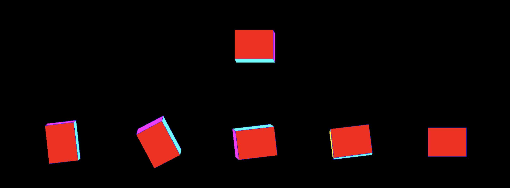

# Calibration 

First, accelerometer and magnetometer measurements require calibration. 
Connect MPU9250 sensortag to your laptop and run accel_calibration.py and magnetomeer_calib.py. 
These files creates accel_values_for_calibration.txt and mag_values_for_calibration.txt and displays scale values. Please add the scale values to the other code files when imu_algorithms are used. 

# Sensor Streaming Application

sensorstreamapp.py streams imu values from MPU9250 and shows its movement with pygame's ponycube in selected imu algorithm. 

# Comparison with data collected by Optitrack

## record_data.py 
Running this python file records IMU values when MPU9250 starts running 
Creates imu_movement.txt file under optitrack folder.

## optitrack.py
This file reads values from imu and optitrack measurement files and save them into new formatted files. 
It read from imu_movement.txt and writes imu_movement_write.txt file. 
It also reads optitrack_movement.csv saved from optitrack and writes optitrack_movement_write.txt file. 

## optitrack_sim.py
This reads imu values from imu_movement_write.txt and optitrack_movement_write.txt files. 
Then, displays simulated ponycubes simulaneously. It shows the comparison of different imu algorithms. 

